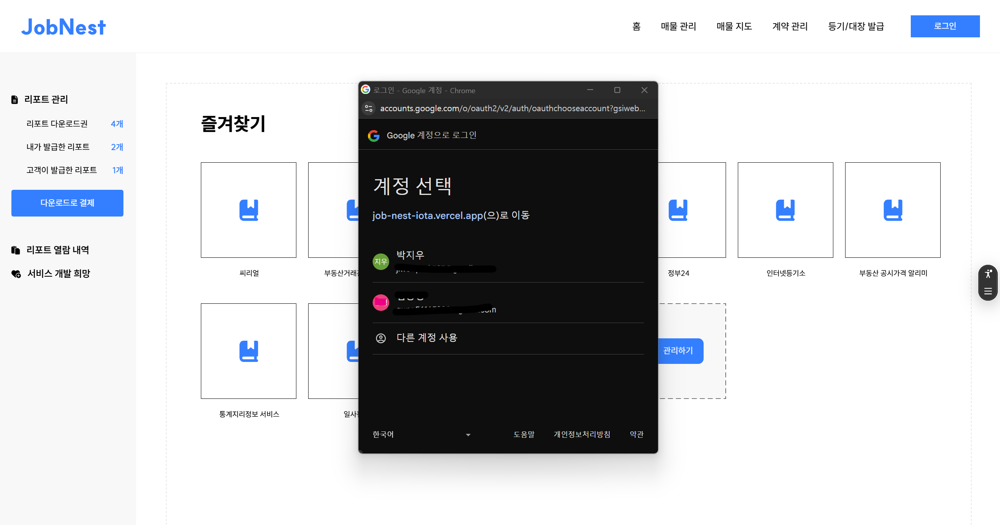
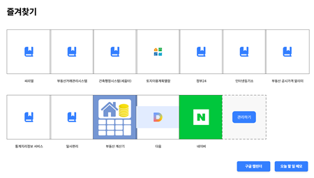
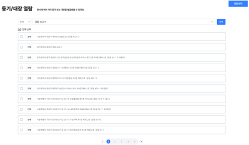
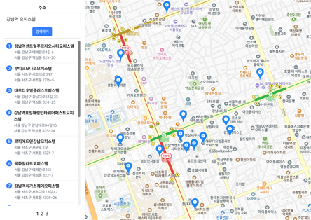
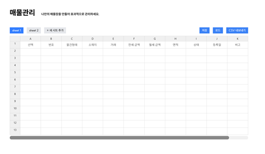
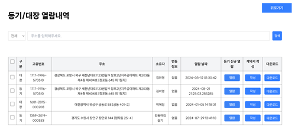
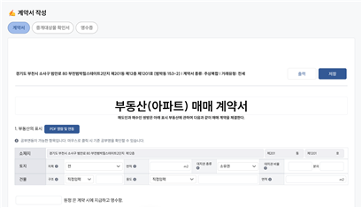

# JobNest - 공인중개사용 매물 관리 플랫폼

## 🚀 프로젝트 소개

**JobNest**는 공인중개사들이 기존에 사용하던 낙후된 사이트의 불편함을 해소하고
기존 사이트들의 기능을 한 데 모아 개발한 공인중개사용 매물 관리 플랫폼입니다.

## 🎯 주요 기능

### 🔹 공인중개사용 플랫폼

- **즐겨찾기 관리**: 자주 이용하는 사이트을 즐겨찾기 형식으로 관리
- **회원 관리**: 구글 로그인(Google OAuth2 지원)
- **할일 관리**: Google Calendar API를 사용하여 할일 관리(+ 자체 TODO LIST 기능도 구현)
- **매물 검색**: 최신 도로명 주소를 통한 매물 검색
- **매물 등록 및 관리**: Handsontable을 활용한 엑셀 시트 스타일 UI 지원
- **지도 기능**: KakaoMap API를 사용한 매물 위치와 주변 시설 확인
- **등기/대장 열람**: 법적 정보 확인 기능 추가 예정(+ 현재는 더미 데이터를 넣어놓은 상태)

## 🛠 기술 스택

- **Frontend**: `React`, `TypeScript`, `Vite`, `Tailwind CSS`
- **Backend**: `nods.js`, `AWS`, `MySQL`, `postgresql`
- **API**: `Google Calendar API`, `KakaoMap API`
- **Deployment**: `Vercel`

## 🎬 데모 배포 사이트 및 스크린샷

🚀 **[JobNest 배포 사이트](https://job-nest-iota.vercel.app)**

<!-- <div style="display: flex; flex-wrap: wrap; justify-content: center; gap: 20px;">
  <div align="center">
    <p><로그인 화면></p>
    
  </div>
  <div align="center">
    <p><즐겨찾기 화면></p>
    
  </div>
  <div align="center">
    <p><주소검색 화면></p>
    
  </div>
  <div align="center">
    <p><지도 화면></p>
    
  </div>
  <div align="center">
    <p><매물관리 화면></p>
    
  </div>
  <div align="center">
    <p><등기대장 화면></p>
    
  </div>
  <div align="center">
    <p><계약서 화면></p>
    
  </div>
</div> -->

<table>
  <tr>
    <td align="center">
      <p>로그인 화면</p>
      
    </td>
    <td align="center">
      <p>즐겨찾기 화면</p>
      
    </td>
  </tr>
  <tr>
    <td align="center">
      <p>주소검색 화면</p>
      
    </td>
    <td align="center">
      <p>지도 화면</p>
      
    </td>
  </tr>
  <tr>
    <td align="center">
      <p>매물관리 화면</p>
      
    </td>
    <td align="center">
      <p>등기대장 화면</p>
      
    </td>
  </tr>
  <tr>
    <td align="center">
      <p>계약서 화면</p>
      
    </td>
  </tr>
</table>

## 🏗 프로젝트 구조

```plaintext
/📦 src
  ├──📁 assets       # 이미지, 아이콘
  ├──📁 components   # 재사용 가능한 UI 컴포넌트
  ├──📁 redux        # 상태 관리
  ├──📁 types        # 유틸리티 함수
  ├──📁 views        # 페이지 단위 컴포넌트
```

## 🔧 설치 및 실행 방법

```bash
# 레포지토리 클론
git clone [https://github.com/JIWOO/jobnest.git](https://github.com/jiwoopark727/job-nest.git)
cd jobnest

# 패키지 설치
npm install

# 환경 변수 설정 (.env 파일 생성 후 환경 변수 추가)
(생략... 필요시 문의 메일 부탁드립니다)

# 개발 서버 실행
npm run dev
```

## 📜 라이선스

본 프로젝트는 **MIT 라이선스**를 따릅니다.
